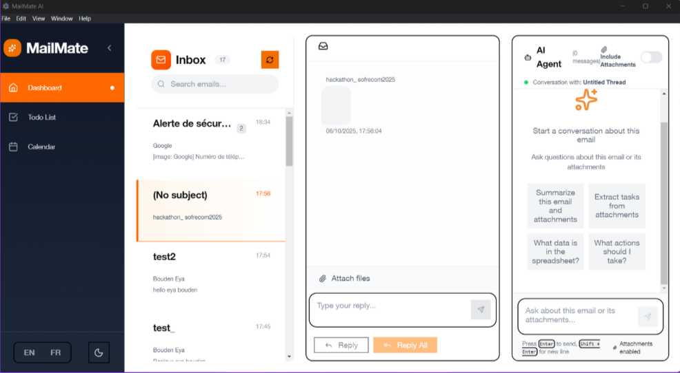

# MailMate AI - Backend Documentation

🚀 **Multimodal Email Assistant Backend** powered by Google Gemini AI

<p align="center">
  
</p>

## 🎉 NEW: Automatic Gmail Authentication!

✅ **One-time setup** - Authenticate once, work forever  
✅ **Auto token refresh** - No manual intervention needed  
✅ **No auth headers** - Just call the API endpoints  
✅ **Instant startup** - Gmail service ready on server start  

👉 See [AUTO_AUTH_GUIDE.md](AUTO_AUTH_GUIDE.md) for setup instructions

## 📋 Table of Contents

- [Overview](#overview)
- [Features](#features)
  - [Email Intelligence](#-email-intelligence)
  - [Attachment Processing](#-advanced-attachment-processing)
  - [Conversational AI](#-conversational-ai)
  - [Gmail API Integration](#-gmail-api-integration-new)
- [Project Structure](#project-structure)
- [Setup & Installation](#setup--installation)
- [API Endpoints](#api-endpoints)
- [Usage Examples](#usage-examples)
- [Frontend Integration Guide](#frontend-integration-guide)
- [Deployment](#deployment)

---

## 🎯 Overview

MailMate AI Backend is a FastAPI-powered service that provides intelligent email processing capabilities using Google's Gemini AI. It analyzes emails, extracts tasks, suggests meetings, translates content, and intelligently processes attachments including Excel, CSV, PDF files, and images.

### Key Technologies

- **FastAPI**: Modern, high-performance web framework
- **Google Gemini AI**: Advanced multimodal AI (gemini-2.5-flash-exp & gemini-1.5-pro)
- **Gmail API**: Automatic OAuth authentication with token refresh
- **Pandas**: Data manipulation for Excel/CSV operations
- **PyMuPDF**: PDF text extraction
- **Pytesseract**: OCR for image-to-text conversion
- **Pydantic**: Data validation and settings management

We have to use Boosted from orange these are the elements they have:
tooltip, toast, tab, scrollspy, quantity-selector, popover, orange-navbar, offcanvas, modal, dropdown, collapses, carousel, button, base-component, alert, sticker 

You can import them like so (they are set-up as scss): 

<div className="container py-4 px-3 mx-auto">
  <h1> Something here</h1>
  <button className="btn btn-primary">Primary button</button>
</div>
<div class="sticker">
  <p class="mb-0">
    <span class="sticker-fs-3xl mb-0 d-block">39.99 €</span>
    <span>Per month</span>
  </p>
</div>
<div id="carouselExample" class="carousel slide">
  <div class="carousel-inner">
    <div class="carousel-item active">
      
    </div>
    <div class="carousel-item">
      
    </div>
    <div class="carousel-item">
      
    </div>
  </div>
  <button class="carousel-control-prev" type="button" data-bs-target="#carouselExample" data-bs-slide="prev">
    <span class="carousel-control-prev-icon" aria-hidden="true"></span>
    <span class="visually-hidden">Previous</span>
  </button>
  <button class="carousel-control-next" type="button" data-bs-target="#carouselExample" data-bs-slide="next">
    <span class="carousel-control-next-icon" aria-hidden="true"></span>
    <span class="visually-hidden">Next</span>
  </button>
</div>

<a href="#" class="position-relative">
  <svg width="2rem" height="2rem" fill="currentColor" aria-hidden="true">
    <use xlink:href="/docs/5.3/assets/img/boosted-sprite.svg#buy"/>
  </svg>
  <span class="visually-hidden">Shopping basket</span>
  <span class="position-absolute top-0 start-100 translate-middle badge rounded-pill text-bg-info">
    99+
    <span class="visually-hidden">shopping basket items</span>
  </span>
</a>

and so on

---

## ✨ Features

### 🧠 Email Intelligence
- **Comprehensive Analysis**: Summary, key points, sentiment, urgency detection
- **Task Detection**: Automatically extract actionable items with priorities
- **Meeting Suggestions**: Smart meeting scheduling from email context
- **Multi-language Translation**: Translate emails to any language
- **Entity Extraction**: People, organizations, dates, locations

### 📎 Advanced Attachment Processing
- **Smart Query System**: Ask questions about any attachment
- **Excel Operations**: Read sheets, sum columns, filter data, statistics
- **CSV Operations**: Group by, aggregate functions, filtering
- **PDF Processing**: Text extraction by page range, image extraction
- **Image OCR**: Extract text from images (JPG, PNG, etc.)
- **Document Support**: .docx, .eml, .txt files

### 💬 Conversational AI
- **Context-Aware Chat**: Ask follow-up questions about emails
- **Attachment Q&A**: Query specific attachment content
- **Natural Language Operations**: "What's the sum of sales column?"

### 📧 Gmail API Integration (NEW!)
- **Email Management**: Send, reply, forward, and delete emails
- **Smart Search**: Advanced Gmail query syntax support
- **Label Operations**: Manage labels and categorize emails
- **OAuth 2.0**: Secure authentication with Google
- **Attachment Support**: Send emails with attachments
- **Thread Support**: Maintain email conversation threads

> 📚 **Documentation**: See [GMAIL_API_README.md](GMAIL_API_README.md) for setup instructions and [INTEGRATION_GUIDE.md](INTEGRATION_GUIDE.md) for backend integration.

---

## 📁 Project Structure

```
sofrecom-hackathon/
├── backend/                     # Main MailMate AI Backend
│   ├── main.py                  # FastAPI application entry point
│   ├── requirements.txt         # Python dependencies
│   ├── models/
│   │   └── schemas.py          # Pydantic models
│   ├── services/
│   │   └── gemini_service.py   # Gemini AI integration
│   └── routers/
│       ├── ai.py               # AI processing endpoints
│       ├── attachments.py      # Attachment processing
│       └── utils.py            # Utility functions
│
├── app/                         # Gmail API Backend (NEW!)
│   ├── main.py                  # Gmail API FastAPI app
│   ├── gmail_service.py         # Gmail API service
│   ├── models.py                # Gmail Pydantic models
│   └── auth.py                  # Authentication utilities
│
├── MailMate-AI/                 # React Frontend
│   ├── src/
│   │   ├── components/         # React components
│   │   └── services/           # API integration
│   └── package.json
│
└── Documentation/
    ├── GMAIL_API_README.md      # Gmail API setup guide
    ├── API_DOCUMENTATION.md     # API endpoint reference
    ├── INTEGRATION_GUIDE.md     # Backend integration guide
    └── SUMMARY.md               # Quick reference
```

---

## 🛠️ Setup & Installation

### Prerequisites

1. **Python 3.9+**
2. **Tesseract OCR** (for image text extraction)
   ```bash
   # Ubuntu/Debian
   sudo apt-get install tesseract-ocr
   
   # macOS
   brew install tesseract
   
   # Windows
   # Download from: https://github.com/UB-Mannheim/tesseract/wiki
   ```

### Installation Steps

1. **Clone the repository** (or navigate to server directory)
   ```bash
   cd server
   ```

2. **Create virtual environment**
   ```bash
   python -m venv venv
   
   # Activate it
   # Linux/Mac:
   source venv/bin/activate
   # Windows:
   venv\Scripts\activate
   ```

3. **Install dependencies**
   ```bash
   pip install -r requirements.txt
   ```

4. **Configure environment variables**
   ```bash
   cp .env.example .env
   ```
   
   Edit `.env` and add your Gemini API key:
   ```env
   GEMINI_API_KEY=your_actual_api_key_here
   ```
   
   Get your API key from: https://makersuite.google.com/app/apikey

5. **Run the server**
   ```bash
   # Development mode with auto-reload
   uvicorn main:app --reload
   
   # Production mode
   uvicorn main:app --host 0.0.0.0 --port 5000
   ```

6. **Test the API**
   - Open browser: http://localhost:5000
   - Interactive docs: http://localhost:5000/docs
   - Alternative docs: http://localhost:5000/redoc

---

## 🌐 API Endpoints

### Base URL: `http://localhost:5000`

### Health Check
```
GET /health
```
Returns API health status.

---

### 📧 Email Processing Endpoints (`/ai/*`)

#### 1. Process Email
```
POST /ai/process
```

**Description**: Analyze email and extract comprehensive insights.

**Request** (multipart/form-data):
```javascript
// Option 1: File upload
FormData {
  file: File (PDF, EML, TXT, etc.)
}

// Option 2: Text paste
FormData {
  email_text: "Email content as string"
}
```

**Response**:
```json
{
  "success": true,
  "email_content": "Email text preview...",
  "analysis": {
    "summary": "Concise 2-3 sentence summary",
    "key_points": ["point 1", "point 2"],
    "sentiment": "positive/neutral/negative/urgent",
    "urgency": "low/medium/high/critical",
    "language_detected": "English",
    "tasks": [
      {
        "task": "Send quarterly report",
        "priority": "high",
        "due_date": "2025-10-10",
        "assigned_to": null
      }
    ],
    "meeting_suggestions": [
      {
        "title": "Q4 Planning Meeting",
        "suggested_date": "2025-10-15",
        "suggested_time": "14:00",
        "duration": "1 hour",
        "attendees": ["John", "Sarah"],
        "location": "Conference Room A",
        "notes": "Discuss budget allocation"
      }
    ],
    "entities": {
      "people": ["John Doe", "Sarah Smith"],
      "organizations": ["TechCorp"],
      "dates": ["October 15", "next Monday"],
      "locations": ["New York Office"]
    },
    "follow_up_required": true,
    "attachments_mentioned": ["report.pdf"]
  },
  "attachments": [...]
}
```

---

#### 2. Chat with AI
```
POST /ai/chat
```

**Description**: Conversational interface with email context.

**Request Body**:
```json
{
  "history": [
    {
      "role": "user",
      "content": "What's the main point of this email?"
    },
    {
      "role": "assistant",
      "content": "The main point is discussing Q4 planning..."
    }
  ],
  "user_input": "What tasks were mentioned?",
  "context": "Optional email content for context"
}
```

**Response**:
```json
{
  "success": true,
  "response": "The email mentions the following tasks: 1) Send quarterly report..."
}
```

---

#### 3. Translate Text
```
POST /ai/translate
```

**Description**: Translate text to any language.

**Request Body**:
```json
{
  "text": "Hello, how are you?",
  "target_language": "French",
  "source_language": "English"
}
```

**Response**:
```json
{
  "success": true,
  "translation": {
    "translated_text": "Bonjour, comment allez-vous?",
    "source_language": "English",
    "target_language": "French",
    "translation_notes": "Formal translation used"
  }
}
```

---

#### 4. Detect Tasks
```
POST /ai/detect-tasks
```

**Description**: Extract actionable tasks from email.

**Request Body**:
```json
{
  "email_text": "Please send the report by Friday and schedule a meeting with the team."
}
```

**Response**:
```json
{
  "success": true,
  "tasks": [
    {
      "task": "Send the report",
      "priority": "high",
      "due_date": "2025-10-10",
      "estimated_time": "30 minutes",
      "assigned_to": null
    },
    {
      "task": "Schedule a meeting with the team",
      "priority": "medium",
      "due_date": null,
      "estimated_time": null,
      "assigned_to": null
    }
  ],
  "count": 2
}
```

---

#### 5. Suggest Meetings
```
POST /ai/suggest-meetings
```

**Description**: Generate meeting suggestions from email content.

**Request Body**:
```json
{
  "email_text": "We should discuss the Q4 strategy next week.",
  "user_availability": ["2025-10-15T14:00:00", "2025-10-16T10:00:00"]
}
```

**Response**:
```json
{
  "success": true,
  "meetings": [
    {
      "title": "Q4 Strategy Discussion",
      "purpose": "Discuss Q4 strategy and goals",
      "suggested_date": "2025-10-15",
      "suggested_time": "14:00",
      "duration": "1 hour",
      "attendees": [],
      "priority": "high",
      "location": "virtual",
      "preparation_needed": "Review Q3 results",
      "notes": "Align on strategic priorities"
    }
  ],
  "count": 1
}
```

---

#### 6. Classify Attachment
```
POST /ai/classify-attachment
```

**Description**: Classify and analyze attachment files.

**Request** (multipart/form-data):
```javascript
FormData {
  file: File,
  extract_preview: true/false
}
```

**Response**:
```json
{
  "success": true,
  "filename": "invoice.pdf",
  "size": 245678,
  "mime_type": "application/pdf",
  "classification": {
    "category": "Invoice",
    "subcategory": "Financial Document",
    "suggested_action": "Review and process payment",
    "priority": "high",
    "keywords": ["invoice", "payment", "billing"],
    "description": "Invoice document for services rendered"
  }
}
```

---

#### 7. Analyze Multiple Emails
```
POST /ai/analyze-multiple
```

**Description**: Batch analyze multiple email files.

**Request** (multipart/form-data):
```javascript
FormData {
  files: [File1, File2, File3]
}
```

**Response**:
```json
{
  "success": true,
  "count": 3,
  "results": [
    {
      "filename": "email1.eml",
      "analysis": { /* analysis object */ }
    }
  ]
}
```

---

### 📎 Attachment Processing Endpoints (`/attachments/*`)

#### 1. Query Attachment
```
POST /attachments/query
```

**Description**: Ask natural language questions about attachment content.

**Request Body**:
```json
{
  "filename": "report.pdf",
  "query": "What is the total revenue mentioned?",
  "file_content_base64": "base64_encoded_file_content"
}
```

**Response**:
```json
{
  "success": true,
  "filename": "report.pdf",
  "query": "What is the total revenue mentioned?",
  "answer": "The total revenue mentioned in the document is $1.5 million for Q3 2025."
}
```

---

#### 2. Excel Operations
```
POST /attachments/excel-operations
```

**Description**: Perform operations on Excel files.

**Supported Operations**:
- `list_sheets`: Get all sheet names
- `read_sheet`: Read sheet data
- `sum_column`: Calculate column sum
- `filter_rows`: Filter rows by condition
- `get_cell`: Get specific cell value
- `statistics`: Get statistical analysis

**Request Body**:
```json
{
  "filename": "sales_data.xlsx",
  "operation": "sum_column",
  "file_content_base64": "base64_encoded_content",
  "parameters": {
    "sheet_name": "Sheet1",
    "column_name": "Revenue"
  }
}
```

**Response**:
```json
{
  "success": true,
  "filename": "sales_data.xlsx",
  "operation": "sum_column",
  "result": {
    "column": "Revenue",
    "sum": 125000.50,
    "count": 45
  }
}
```

---

#### 3. CSV Operations
```
POST /attachments/csv-operations
```

**Description**: Perform operations on CSV files.

**Supported Operations**:
- `read_rows`: Read specific rows
- `sum_column`: Calculate column sum
- `filter`: Filter data by condition
- `statistics`: Get statistical summary
- `group_by`: Group and aggregate data

**Request Body**:
```json
{
  "filename": "data.csv",
  "operation": "group_by",
  "file_content_base64": "base64_encoded_content",
  "parameters": {
    "group_column": "Category",
    "agg_column": "Sales",
    "agg_func": "sum"
  }
}
```

**Response**:
```json
{
  "success": true,
  "filename": "data.csv",
  "operation": "group_by",
  "result": {
    "grouped_data": [
      {"Category": "Electronics", "Sales": 50000},
      {"Category": "Clothing", "Sales": 30000}
    ]
  }
}
```

---

#### 4. PDF Extract
```
POST /attachments/pdf-extract
```

**Description**: Extract text and images from PDF files.

**Request Body**:
```json
{
  "filename": "document.pdf",
  "file_content_base64": "base64_encoded_content",
  "page_range": "1-5",
  "extract_images": true
}
```

**Response**:
```json
{
  "success": true,
  "result": {
    "filename": "document.pdf",
    "total_pages": 10,
    "extracted_pages": [1, 2, 3, 4, 5],
    "text": "Full extracted text...",
    "text_by_page": {
      "1": "Page 1 text...",
      "2": "Page 2 text..."
    },
    "images": [
      {
        "page": 1,
        "image_index": 0,
        "image_base64": "..."
      }
    ],
    "ai_summary": "This document discusses..."
  }
}
```

---

#### 5. Smart Query
```
POST /attachments/smart-query
```

**Description**: Intelligent query that auto-detects file type and performs appropriate operations.

**Request Body**:
```json
{
  "filename": "sales.xlsx",
  "query": "What's the total of the revenue column?",
  "file_content_base64": "base64_encoded_content"
}
```

**Response**: Auto-detects file type and returns appropriate results.

---

## 💡 Usage Examples

### Example 1: Analyze Email with Python

```python
import requests
import base64

url = "http://localhost:5000/ai/process"

# Option 1: Upload file
with open("email.eml", "rb") as f:
    files = {"file": f}
    response = requests.post(url, files=files)

# Option 2: Send text
data = {"email_text": "Your email content here"}
response = requests.post(url, data=data)

result = response.json()
print(f"Summary: {result['analysis']['summary']}")
print(f"Tasks: {result['analysis']['tasks']}")
```

---

### Example 2: Query Excel File with JavaScript

```javascript
// Read file and convert to base64
const fileInput = document.getElementById('fileInput');
const file = fileInput.files[0];
const reader = new FileReader();

reader.onload = async function(e) {
  const base64Content = e.target.result.split(',')[1];
  
  const response = await fetch('http://localhost:5000/attachments/excel-operations', {
    method: 'POST',
    headers: {
      'Content-Type': 'application/json'
    },
    body: JSON.stringify({
      filename: file.name,
      operation: 'sum_column',
      file_content_base64: base64Content,
      parameters: {
        sheet_name: 'Sheet1',
        column_name: 'Sales'
      }
    })
  });
  
  const result = await response.json();
  console.log('Total Sales:', result.result.sum);
};

reader.readAsDataURL(file);
```

---

### Example 3: Chat with Context using cURL

```bash
curl -X POST "http://localhost:5000/ai/chat" \
  -H "Content-Type: application/json" \
  -d '{
    "history": [
      {"role": "user", "content": "What is this email about?"},
      {"role": "assistant", "content": "This email is about Q4 planning..."}
    ],
    "user_input": "What are the action items?",
    "context": "Email content here..."
  }'
```

---

### Example 4: Translate Email Content

```python
import requests

url = "http://localhost:5000/ai/translate"
payload = {
    "text": "Please review the attached document and provide feedback.",
    "target_language": "Spanish",
    "source_language": "English"
}

response = requests.post(url, json=payload)
result = response.json()
print(result['translation']['translated_text'])
# Output: "Por favor revise el documento adjunto y proporcione comentarios."
```

---

## 🔗 Frontend Integration Guide

### React/Next.js Integration

```javascript
// services/mailmateApi.js
const API_BASE_URL = process.env.NEXT_PUBLIC_API_URL || 'http://localhost:5000';

export const mailmateAPI = {
  // Process email
  processEmail: async (emailText = null, file = null) => {
    const formData = new FormData();
    if (file) formData.append('file', file);
    if (emailText) formData.append('email_text', emailText);
    
    const response = await fetch(`${API_BASE_URL}/ai/process`, {
      method: 'POST',
      body: formData
    });
    return response.json();
  },
  
  // Chat with AI
  chat: async (history, userInput, context = null) => {
    const response = await fetch(`${API_BASE_URL}/ai/chat`, {
      method: 'POST',
      headers: { 'Content-Type': 'application/json' },
      body: JSON.stringify({ history, user_input: userInput, context })
    });
    return response.json();
  },
  
  // Translate text
  translate: async (text, targetLanguage, sourceLanguage = null) => {
    const response = await fetch(`${API_BASE_URL}/ai/translate`, {
      method: 'POST',
      headers: { 'Content-Type': 'application/json' },
      body: JSON.stringify({ text, target_language: targetLanguage, source_language: sourceLanguage })
    });
    return response.json();
  },
  
  // Query attachment
  queryAttachment: async (filename, query, fileBase64) => {
    const response = await fetch(`${API_BASE_URL}/attachments/query`, {
      method: 'POST',
      headers: { 'Content-Type': 'application/json' },
      body: JSON.stringify({
        filename,
        query,
        file_content_base64: fileBase64
      })
    });
    return response.json();
  }
};

// Usage in component
import { useState } from 'react';
import { mailmateAPI } from '@/services/mailmateApi';

function EmailAnalyzer() {
  const [result, setResult] = useState(null);
  const [loading, setLoading] = useState(false);
  
  const handleAnalyze = async (emailText) => {
    setLoading(true);
    try {
      const data = await mailmateAPI.processEmail(emailText);
      setResult(data);
    } catch (error) {
      console.error('Analysis failed:', error);
    } finally {
      setLoading(false);
    }
  };
  
  return (
    <div>
      {/* Your UI components */}
    </div>
  );
}
```

---

### File Upload Helper

```javascript
// utils/fileHelpers.js

/**
 * Convert file to base64
 */
export const fileToBase64 = (file) => {
  return new Promise((resolve, reject) => {
    const reader = new FileReader();
    reader.onload = () => {
      const base64 = reader.result.split(',')[1];
      resolve(base64);
    };
    reader.onerror = reject;
    reader.readAsDataURL(file);
  });
};

/**
 * Process attachment with smart query
 */
export const processAttachment = async (file, query) => {
  const base64Content = await fileToBase64(file);
  
  const response = await fetch('http://localhost:5000/attachments/smart-query', {
    method: 'POST',
    headers: { 'Content-Type': 'application/json' },
    body: JSON.stringify({
      filename: file.name,
      query: query,
      file_content_base64: base64Content
    })
  });
  
  return response.json();
};
```

---

## 🚀 Deployment

### Deploy with Docker

1. **Create Dockerfile**:

```dockerfile
FROM python:3.11-slim

WORKDIR /app

# Install system dependencies
RUN apt-get update && apt-get install -y \
    tesseract-ocr \
    tesseract-ocr-eng \
    && rm -rf /var/lib/apt/lists/*

# Copy requirements and install Python dependencies
COPY requirements.txt .
RUN pip install --no-cache-dir -r requirements.txt

# Copy application code
COPY . .

# Expose port
EXPOSE 5000

# Run the application
CMD ["uvicorn", "main:app", "--host", "0.0.0.0", "--port", "5000"]
```

2. **Build and run**:

```bash
# Build image
docker build -t mailmate-backend .

# Run container
docker run -p 5000:5000 \
  -e GEMINI_API_KEY=your_api_key \
  mailmate-backend
```

---

### Deploy to Render.com

1. **Create `render.yaml`**:

```yaml
services:
  - type: web
    name: mailmate-backend
    env: python
    buildCommand: "pip install -r requirements.txt"
    startCommand: "uvicorn main:app --host 0.0.0.0 --port $PORT"
    envVars:
      - key: GEMINI_API_KEY
        sync: false
      - key: PYTHON_VERSION
        value: 3.11.0
```

2. Connect your repository and deploy!

---

### Deploy to Railway

1. **Push to GitHub**
2. **Connect Railway to your repo**
3. **Add environment variables**:
   - `GEMINI_API_KEY`
4. **Railway auto-detects Python and deploys!**

---

### Environment Variables for Production

```env
# Required
GEMINI_API_KEY=your_production_api_key

# Server
HOST=0.0.0.0
PORT=5000
DEBUG=False

# CORS - Specify your frontend URLs
ALLOWED_ORIGINS=https://yourdomain.com,https://app.yourdomain.com

# File limits
MAX_FILE_SIZE_MB=50

# Optional: Custom Tesseract path
TESSERACT_CMD=/usr/bin/tesseract
```

---

## 🔒 Security Best Practices

1. **Never commit `.env` file** - Always use `.env.example` as template
2. **Use environment variables** for all sensitive data
3. **Implement rate limiting** for production
4. **Validate file uploads** - Check size, type, and content
5. **Use HTTPS** in production
6. **Restrict CORS origins** - Don't use `*` in production
7. **Implement authentication** for sensitive endpoints
8. **Monitor API usage** - Track Gemini API costs

---

## 🐛 Troubleshooting

### Common Issues

**Issue**: `Gemini service not initialized`
- **Solution**: Check that `GEMINI_API_KEY` is set correctly in `.env`

**Issue**: `Tesseract not found`
- **Solution**: Install Tesseract OCR and add to PATH

**Issue**: `Module not found` errors
- **Solution**: Run `pip install -r requirements.txt` in virtual environment

**Issue**: CORS errors in frontend
- **Solution**: Add your frontend URL to `ALLOWED_ORIGINS` in `.env`

**Issue**: Large file upload fails
- **Solution**: Increase `MAX_FILE_SIZE_MB` in settings

---

## 📚 Additional Resources

- [FastAPI Documentation](https://fastapi.tiangolo.com/)
- [Google Gemini AI](https://ai.google.dev/)
- [Pandas Documentation](https://pandas.pydata.org/)
- [PyMuPDF Documentation](https://pymupdf.readthedocs.io/)

---

## 📝 License

MIT License - See LICENSE file for details

---

## 🤝 Contributing

Contributions are welcome! Please:

1. Fork the repository
2. Create a feature branch (`git checkout -b feature/AmazingFeature`)
3. Commit your changes (`git commit -m 'Add some AmazingFeature'`)
4. Push to the branch (`git push origin feature/AmazingFeature`)
5. Open a Pull Request

---

## 📧 Support

For issues or questions:
- Open an issue on GitHub
- Contact: support@mailmate-ai.com

---

**Built with ❤️ using FastAPI and Google Gemini AI**